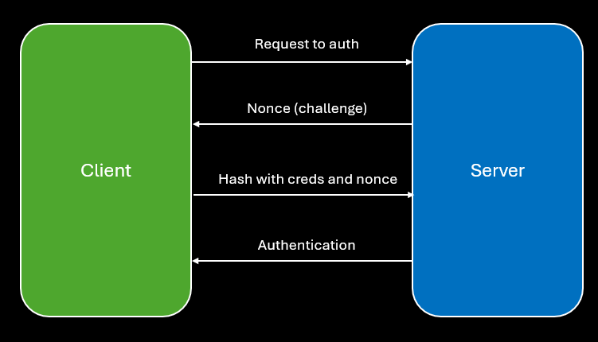
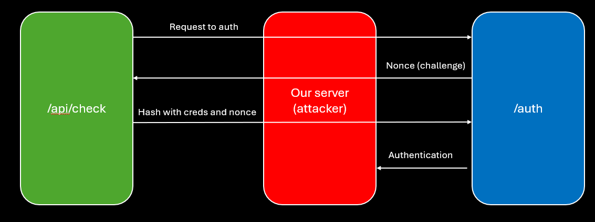

# BuckeyeCTF - AUTHMAN

#### Challenge Description
>passwords won't save you now NOTE: remote can only connect to ports 80/443
>
>[https://authman.challs.pwnoh.io](https://authman.challs.pwnoh.io)

[!button icon="download" text="authman.zip"](../files/web/authman.zip)

## Solution

Looking at the source code (`auth.html`, `routes.py`), we can tell that in order to get the flag, we need to authenticate on the `/auth` endpoint.

Looking at the provided `routes.py`, we can see that the authentication is done using Digest access authentication (`HTTPDigestAuth`), which is an authentication method that doesn't send the password in plaintext, but uses a challenge-response mechanism:

1. Client sends a request to the server that doesn't contain any credentials.
2. Server responds with a 401 Unauthorized status code and a "WWW-Authenticate" header that contains a nonce (a random value).
3. Client uses the nonce, username, password, HTTP method, and requested URL to create a hash (MD5 by default) and sends it back to the server in the "Authorization" header.
4. Server performs the same hash calculation with the stored password and compares it to the hash sent by the client. If they match, the client is authenticated and will receive access to the protected resource.

---

A major flaw in this protocol is that it's vulnerable to MITM relay attacks - if we had a server between the client and the real server, we could relay the server's challenge to the client, let the client compute the authentication response, and when the client sends us the Authorization header, we could relay it to the real server ourselves and get authenticated.

Luckily for us, we have an endpoint that can authenticate using Digest authentication on our behalf - the `/api/check` endpoint, which gets the first username and password from the database (`(user, pw), *_ = app.config['AUTH_USERS'].items()`) and sends a request to authenticate using the protocol: `auth = HTTPDigestAuth(user,pw)`.

Luckily for us, we can control the endpoint that the server will send the request to, because the server uses the `Referer` header to get the URL!

So in order to authenticate on `/auth`, we can set up a server that will act as a MITM relay between our client and the real server:
1. The `/api/check` endpoint will try to authenticate with our MITM server, which will forward the request to the `/auth` endpoint on the server.
2. `/auth` will respond with a challenge, which we will relay to `/api/check`.
3. `/api/check` will compute the Authorization header using its stored username and password, and send it to our MITM server.
4. Our MITM server will pass the Authorization header to the `/auth` endpoint, which will authenticate us and return the flag.

---

To implement this, we can use Flask to create a simple MITM server that will relay the requests between the client and the real server, and host it on a public server (e.g., using ngrok)

1. run the server: [link to code](../files/web/buckeye2025_authman_solve.py)
2. Setup ngrok to expose the server to the internet: `ngrok http 8080`
3. Call `/api/check` with the `Referer` header set to our ngrok URL: 
`curl -H "Referer: http://<ngrok-url>" https://authman.challs.pwnoh.io/api/check`

The flag will be printed in the response on our server.

#### Flag

`bctf{a_new_dog_learns_old_tricks}`