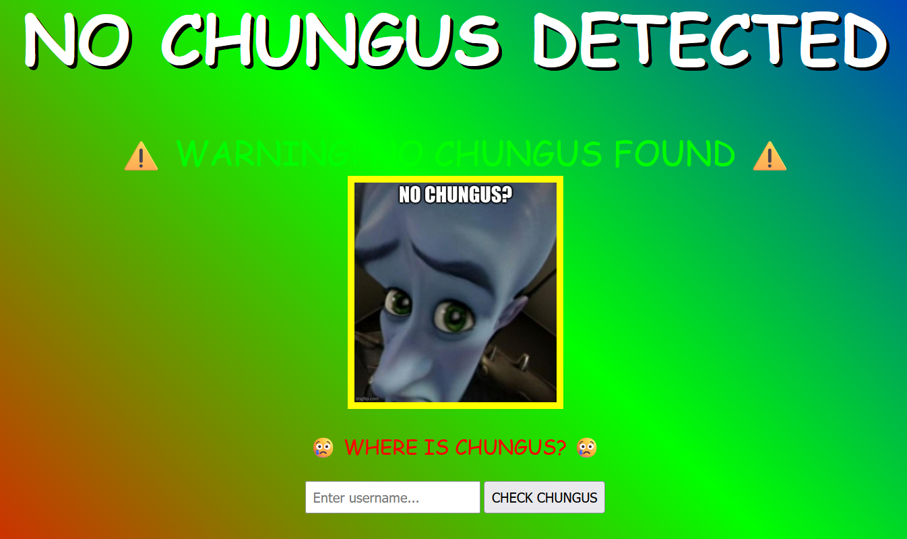
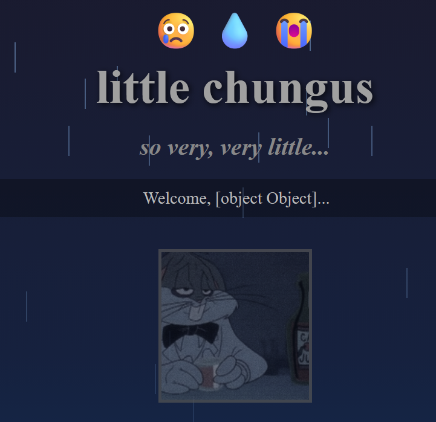

# BuckeyeCTF - BIG CHUNGUS

#### Challenge Description
> There's wabbit twouble afoot
>
> [https://big-chungus.challs.pwnoh.io](https://big-chungus.challs.pwnoh.io)

[!button icon="download" text="big-chungus.zip"](../files/big-chungus.zip)

## Solution

{width="40%"}

Looking at the given 'index.js' we can see the flag will be revealed when this condition is true:

```js
req.query.username.length > 0xB16_C4A6A5
```

However, this is an extremely large number, and any normal input would not satisfy this condition.

We can see that for any input we will put through the box, we will get to the failure page, showing the username.
For example, on https://big-chungus.challs.pwnoh.io/?username=hi we get:
`Welcome, hi...`

When attempting to use the username as an array, to trick the length check (ie. `https://big-chungus.challs.pwnoh.io/?username[100]=hi`), we see the username is printed as `Welcome, [object Object]...`

{width="40%"}

This means that the username is being treated as an object, and thus we can add properties to set the length to a very large number.

To inject it through the URL, we can use:
`https://big-chungus.challs.pwnoh.io/?username[100]=hi&username[length]=99999999999`

Now, when we visit the page, we reach that length check, and pass it because the length property is being read from the object as a very large number.


#### Flag

`bctf{b16_chun6u5_w45_n3v3r_7h15_b16}`