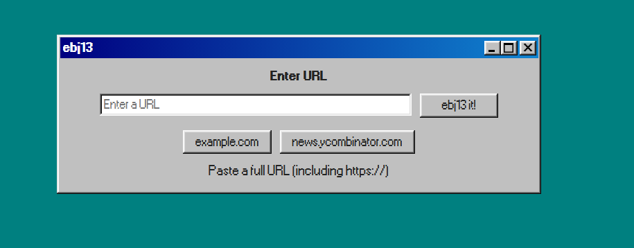
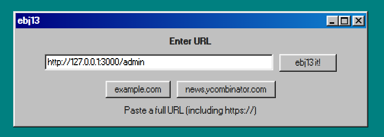

# BuckeyeCTF - ebj3

#### Challenge Description
>V znqr na ncc gung yrgf lbh ivrj gur ebg13 irefvba bs nal jrofvgr!
>
>[https://ebg13.challs.pwnoh.io](https://ebg13.challs.pwnoh.io)

[!button icon="download" text="ebg13.zip"](../../files/ebg13.zip)

## Solution

The description of the challenge in ROT13 [(Cyberchef)](https://gchq.github.io/CyberChef/#recipe=ROT13(true,true,false,13)) says
> I made an app that lets you view the rot13 version of any website!

Looking at the code, we can tell that the flag is shown only if the request is done from localhost (127.0.0.1 or similar)

Basically:
>Server -> Fetch URL -> Show response in ROT13

We can simply tell the server to access itself on the /admin endpoint, which will get us a ROT13 flag (we know to use port 3000 as the server is configured on it)

get us 

`Uryyb frys! Gur synt vf opgs{jung_unccraf_vs_v_hfr_guvf_jrofvgr_ba_vgfrys}.`

By applying ROT13, we get the flag.

#### Flag

`bctf{what_happens_if_i_use_this_website_on_itself}`